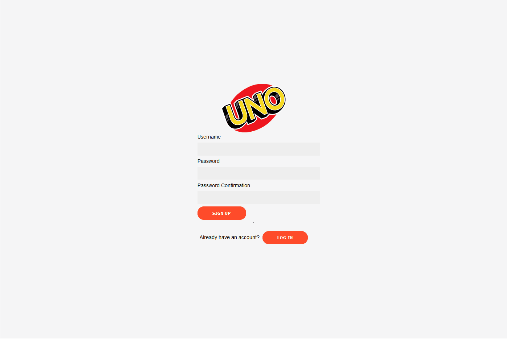
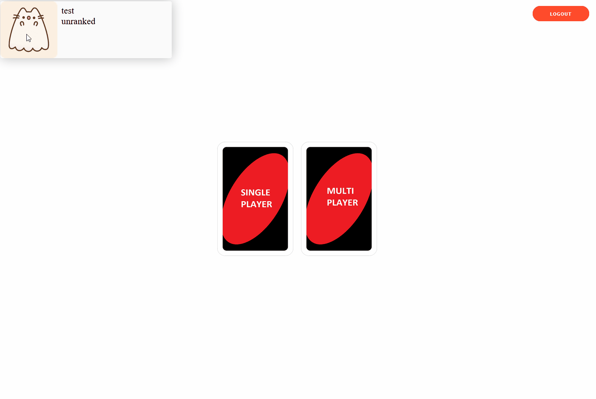
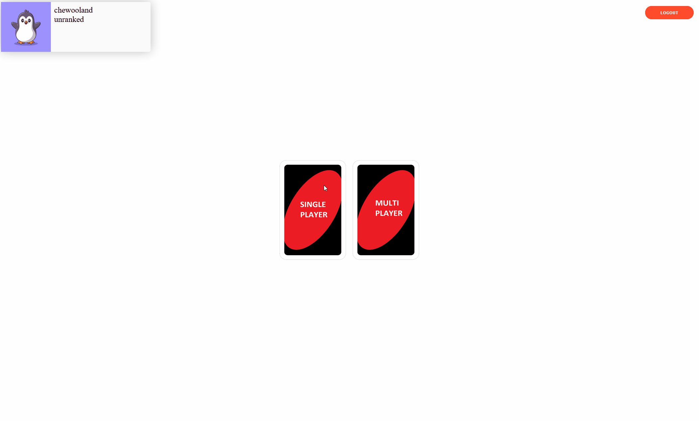

# Uno Game

##Demo

Follow this link to play: https://unogame.onrender.com/
Please note that it may take a while to load as I am using a free Render account.

## Description
Sign up and then log in as a user.


Change your profile picture.


Play a singleplayer game.


Play a multiplayer game.


## Setup

You can use the following commands to run the application:

- `rails s`: run the backend on [http://localhost:3000](http://localhost:3000)
- `npm start --prefix client`: run the frontend on
  [http://localhost:4000](http://localhost:4000)


### Install Postgresql

```sh
sudo apt update
sudo apt install postgresql postgresql-contrib libpq-dev
```

Then confirm that Postgres was installed successfully:

```sh
psql --version
```

Run this command to start the Postgres service:

```sh
sudo service postgresql start
```

Finally, you'll also need to create a database user so that you are able to
connect to the database from Rails. First, check what your operating system
username is:

```sh
whoami
```

If your username is "ian", for example, you'd need to create a Postgres user
with that same name. To do so, run this command to open the Postgres CLI:

```sh
sudo -u postgres -i
```

From the Postgres CLI, run this command (replacing "ian" with your username):

```sh
createuser -sr ian
```

Then enter `control + d` or type `logout` to exit.

[This guide][postgresql wsl] has more info on setting up Postgres on WSL if you
get stuck.

[postgresql wsl]: https://docs.microsoft.com/en-us/windows/wsl/tutorials/wsl-database#install-postgresql

### Install Redis

In my blog post, I cover how to set up Redis: https://medium.com/@loveablessing/rails-6-action-cable-with-react-a11a36d927cd.
